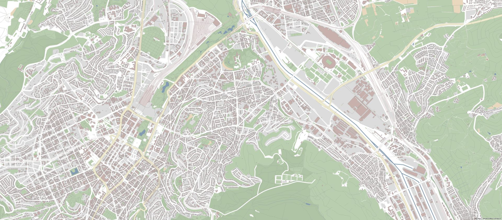

# Maperitive Rules 🗺️

Rules to style maps with [Maperitive](http://maperitive.net/).

## Rules

### 1. Matte Tones - No Text



mattetones-notext.mrules

## Installation

### Preqeuisites

- Have [Maperitive](http://maperitive.net/) installed
- Have the area you want opened in Maperitive (e.g. download from [bbbike.org](https://extract.bbbike.org/))
- Download the rules you like from this repo

### Usage

In the command promt of Maperitive:
```use-ruleset location="pathtotherules\nameoftherule.mrules"```
