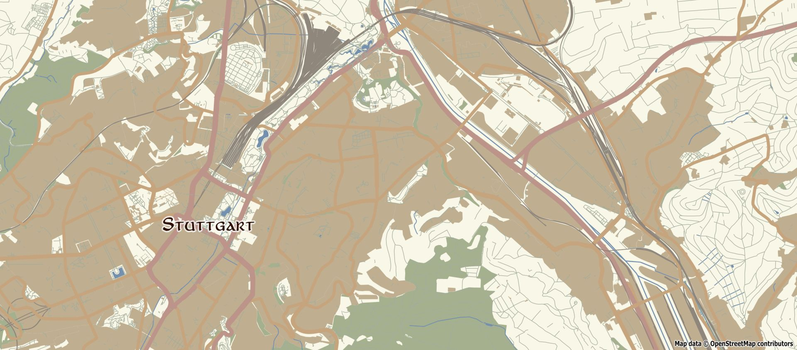

# Maperitive Rules 🗺️

Rules to style maps with [Maperitive](http://maperitive.net/).

## Rules

### 1. Matte Tones - No Text


### 2. Fantasy



Note: Uses ```font-family : Aniron```, make sure you have this font installed or change the font in the rules.

### 3. GPS only

Display only GPS tracks.

## Installation

### Preqeuisites

- Have [Maperitive](http://maperitive.net/) installed
- Have the area you want to render opened in Maperitive (e.g. download from [bbbike.org](https://extract.bbbike.org/))
- Download the rules you like from this repo

### Usage

In the command promt of Maperitive:
```use-ruleset location="pathtotherules\nameoftherule.mrules"```
